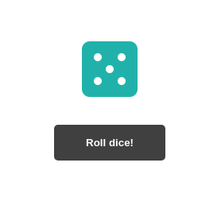

[DiceApp](https://617d4ce8e0b1aedc2eb2f1a3--zen-wilson-05f970.netlify.app/)
============================================================================

A simple dice app exercise made on React.

Used technologies
-----------------

*   **React used in the frontend**

Features
--------

### Functional requirements

*   Render a dice
*   Be able to roll the dice

### Non functional requirements

*   Use FontAwesome
*   Use React for the frontend
  

Screens
-------

### RollDice component

Requirements
------------

*   Node.js
*   Internet connection
*   Internet browser
*   A terminal emulator

How to run
----------

*   Download the project from GitHub
*   Extract project folder if needed
*   Go to the project folder and open a terminal emulator (Gnome Terminal, CMD...)
*   Type 'npm start' and hit enter